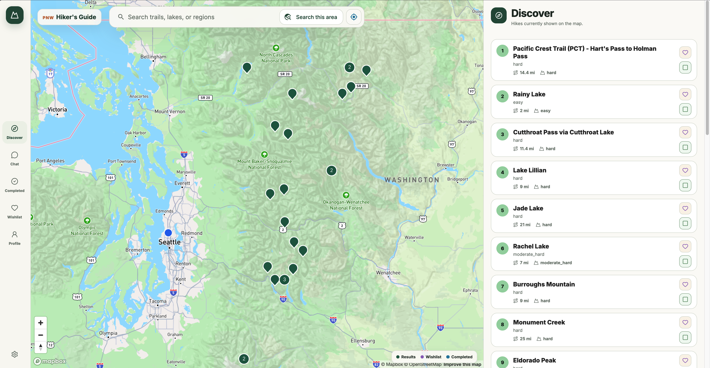

# PNW Hiker's Guide

> A map-first hiking discovery experience for Washington State.

[Explore the live experience](https://pnwhikersguide.com/)

## The product

PNW Hiker's Guide helps hikers move from *where should I go?* to a trail that fits their day. Its calm, desktop-first workspace brings trail discovery, location-aware search, planning context, and personal hiking history into one focused experience.

## What it makes possible

- Explore Washington trails through an interactive, map-led workspace.
- Search trails, lakes, and regions, or discover hikes around a selected area.
- Compare hike distance and difficulty without leaving the map.
- Save promising hikes to a wishlist and keep track of completed adventures.
- Use conversational discovery to narrow a large catalogue into relevant options.
- Build toward weather-aware and preference-aware recommendations.

## Product thinking

The interface is designed to make a broad set of trail options feel approachable: the map provides geographic context, while a clear results panel supports fast comparison and deliberate selection. The visual system uses restrained natural tones, roomy panels, and a stable workspace so that the trail data stays central.

## Technology

The private implementation uses a modern TypeScript stack:

- React and Vite for the client application
- Mapbox for interactive mapping
- Fastify running as a Node.js serverless API on Vercel
- Supabase Auth and PostgreSQL for identity and application data
- Weaviate for semantic trail retrieval
- Gemini for embeddings and grounded hiking recommendations
- LangSmith for AI workflow tracing and evaluation
- Cloudflare for edge delivery, with R2-backed media delivery where configured
- SMTP for transactional authentication email

## Architecture

The browser-facing application is hosted on Vercel and fronted by Cloudflare.
The API keeps server-only integrations—data access, authentication, AI calls,
and observability—outside the browser client.

The CDN/media route is active only where R2-backed assets are configured. The
diagram intentionally shows third-party integrations as separate boundaries:
the UI never directly handles database credentials, authentication secrets, or
AI-provider credentials.

## Project status

PNW Hiker's Guide is an active product prototype. This repository is a public product showcase, not the application source code. Additional case-study material, including system design and implementation notes, will be added here over time.

## Interested in the work?

Open the [live experience](https://pnwhikersguide.com/) to explore the product.
